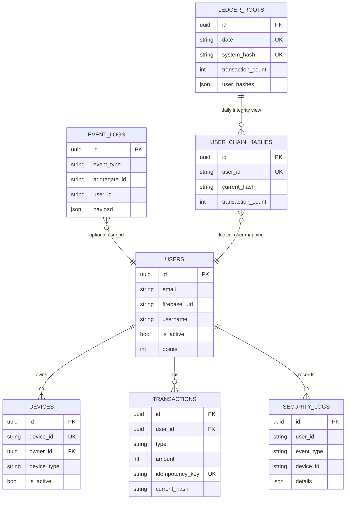

# D/20 — 데이터 모델

---

## 개요

- **RDBMS**: PostgreSQL 15+
- **ORM**: SQLAlchemy 2.0 (비동기)
- **마이그레이션**: Alembic
- **명명 규칙**: snake_case, 테이블명 복수형

---

## ERD 관계 요약

```
users ────────────────────────────────────────────────────────────
  │                                                               │
  ├──< chat_participants >── chat_rooms ──< chat_messages         │
  │                                                               │
  ├──< board_posts ──< board_comments                            │
  │        │                                                      │
  │        └──< board_reactions                                   │
  │                                                               │
  ├──< blog_posts ──< blog_likes                                 │
  │        │                                                      │
  │        └── blog_subscriptions (subscriber_id, author_id)     │
  │                                                               │
  ├──< fcm_tokens                                                 │
  └──< push_notifications                                         │
```

---

## 테이블 상세

### `users` — 사용자

| 컬럼 | 타입 | 제약 | 설명 |
|------|------|------|------|
| `id` | BIGSERIAL | PK | 자동 증가 ID |
| `email` | VARCHAR(255) | UNIQUE, NOT NULL | 이메일 주소 |
| `provider` | VARCHAR(20) | NOT NULL | `google`, `kakao`, `naver` |
| `provider_id` | VARCHAR(255) | NOT NULL | OAuth 제공자 사용자 ID |
| `nickname` | VARCHAR(100) | | 닉네임 (선택) |
| `profile_image` | TEXT | | 프로필 이미지 URL |
| `is_admin` | BOOLEAN | DEFAULT false | 관리자 여부 |
| `is_active` | BOOLEAN | DEFAULT true | 계정 활성 여부 |
| `access_token` | TEXT | | 최근 OAuth 액세스 토큰 (갱신용) |
| `created_at` | TIMESTAMPTZ | DEFAULT NOW() | 가입일시 |
| `updated_at` | TIMESTAMPTZ | | 최종 수정일시 |

**인덱스**:
- `UNIQUE(provider, provider_id)` — OAuth 제공자별 사용자 식별
- `INDEX(email)` — 이메일 검색

```python
# ORM 모델 예시
class User(Base):
    __tablename__ = "users"
    id = Column(BigInteger, primary_key=True, autoincrement=True)
    email = Column(String(255), unique=True, nullable=False)
    provider = Column(String(20), nullable=False)
    provider_id = Column(String(255), nullable=False)
    nickname = Column(String(100))
    is_admin = Column(Boolean, default=False)
    created_at = Column(DateTime(timezone=True), server_default=func.now())
```

---

### `chat_rooms` — 채팅방

| 컬럼 | 타입 | 제약 | 설명 |
|------|------|------|------|
| `id` | BIGSERIAL | PK | 채팅방 ID |
| `type` | VARCHAR(20) | NOT NULL | `direct` (1:1), `group` (예비) |
| `name` | VARCHAR(100) | | 그룹 채팅방 이름 |
| `created_at` | TIMESTAMPTZ | DEFAULT NOW() | 생성일시 |

---

### `chat_participants` — 채팅방 참여자

| 컬럼 | 타입 | 제약 | 설명 |
|------|------|------|------|
| `room_id` | BIGINT | FK(chat_rooms.id) | 채팅방 ID |
| `user_id` | BIGINT | FK(users.id) | 참여자 사용자 ID |
| `joined_at` | TIMESTAMPTZ | DEFAULT NOW() | 참여일시 |

**인덱스**:
- `PRIMARY KEY(room_id, user_id)` — 복합 기본키
- `INDEX(user_id)` — 사용자별 채팅방 조회

---

### `chat_messages` — 채팅 메시지

| 컬럼 | 타입 | 제약 | 설명 |
|------|------|------|------|
| `id` | BIGSERIAL | PK | 메시지 ID |
| `room_id` | BIGINT | FK(chat_rooms.id), NOT NULL | 채팅방 ID |
| `sender_id` | BIGINT | FK(users.id), NOT NULL | 발신자 ID |
| `content` | TEXT | NOT NULL | 메시지 내용 |
| `message_type` | VARCHAR(20) | DEFAULT 'text' | `text`, `image`, `system` |
| `created_at` | TIMESTAMPTZ | DEFAULT NOW() | 발송일시 |

**인덱스**:
- `INDEX(room_id, created_at DESC)` — 채팅방 메시지 이력 조회 (주요 쿼리)

---

### `board_posts` — 게시판 게시글

| 컬럼 | 타입 | 제약 | 설명 |
|------|------|------|------|
| `id` | BIGSERIAL | PK | 게시글 ID |
| `author_id` | BIGINT | FK(users.id), NOT NULL | 작성자 ID |
| `title` | VARCHAR(255) | NOT NULL | 제목 |
| `content` | TEXT | NOT NULL | 내용 |
| `category` | VARCHAR(50) | | 카테고리 |
| `tags` | TEXT[] | DEFAULT '{}' | 태그 배열 |
| `likes_count` | INTEGER | DEFAULT 0 | 좋아요 수 (캐시 컬럼) |
| `comments_count` | INTEGER | DEFAULT 0 | 댓글 수 (캐시 컬럼) |
| `view_count` | INTEGER | DEFAULT 0 | 조회수 |
| `is_deleted` | BOOLEAN | DEFAULT false | 소프트 삭제 |
| `created_at` | TIMESTAMPTZ | DEFAULT NOW() | 작성일시 |
| `updated_at` | TIMESTAMPTZ | | 수정일시 |

**인덱스**:
- `INDEX(author_id)` — 작성자별 게시글 조회
- `INDEX(category, created_at DESC)` — 카테고리별 최신순
- `INDEX(created_at DESC)` — 전체 최신순
- `GIN INDEX(to_tsvector('korean', title || ' ' || content))` — 전문 검색

---

### `board_comments` — 게시판 댓글

| 컬럼 | 타입 | 제약 | 설명 |
|------|------|------|------|
| `id` | BIGSERIAL | PK | 댓글 ID |
| `post_id` | BIGINT | FK(board_posts.id) | 게시글 ID |
| `author_id` | BIGINT | FK(users.id) | 작성자 ID |
| `content` | TEXT | NOT NULL | 댓글 내용 |
| `parent_id` | BIGINT | FK(board_comments.id), NULL | 대댓글 부모 ID (NULL이면 최상위) |
| `is_deleted` | BOOLEAN | DEFAULT false | 소프트 삭제 |
| `created_at` | TIMESTAMPTZ | DEFAULT NOW() | 작성일시 |

**인덱스**:
- `INDEX(post_id, created_at)` — 게시글별 댓글 조회

---

### `board_reactions` — 게시글 반응 (좋아요/북마크)

| 컬럼 | 타입 | 제약 | 설명 |
|------|------|------|------|
| `user_id` | BIGINT | FK(users.id) | 사용자 ID |
| `post_id` | BIGINT | FK(board_posts.id) | 게시글 ID |
| `type` | VARCHAR(20) | NOT NULL | `like`, `bookmark` |
| `created_at` | TIMESTAMPTZ | DEFAULT NOW() | 반응 일시 |

**인덱스**:
- `PRIMARY KEY(user_id, post_id, type)` — 중복 반응 방지

---

### `blog_posts` — 블로그 게시글

| 컬럼 | 타입 | 제약 | 설명 |
|------|------|------|------|
| `id` | BIGSERIAL | PK | 게시글 ID |
| `author_id` | BIGINT | FK(users.id), NOT NULL | 작성자 ID |
| `title` | VARCHAR(255) | NOT NULL | 제목 |
| `content` | TEXT | NOT NULL | 내용 (Markdown) |
| `slug` | VARCHAR(300) | UNIQUE, NOT NULL | URL 슬러그 (제목에서 자동 생성) |
| `category` | VARCHAR(50) | | 카테고리 |
| `tags` | TEXT[] | DEFAULT '{}' | 태그 배열 |
| `view_count` | INTEGER | DEFAULT 0 | 조회수 |
| `likes_count` | INTEGER | DEFAULT 0 | 좋아요 수 (캐시) |
| `is_published` | BOOLEAN | DEFAULT true | 발행 여부 |
| `is_deleted` | BOOLEAN | DEFAULT false | 소프트 삭제 |
| `created_at` | TIMESTAMPTZ | DEFAULT NOW() | 작성일시 |
| `updated_at` | TIMESTAMPTZ | | 수정일시 |

**인덱스**:
- `UNIQUE(slug)` — URL 슬러그 고유
- `INDEX(author_id, created_at DESC)` — 작성자별 최신 글
- `INDEX(created_at DESC)` — 전체 최신순

---

### `blog_likes` — 블로그 좋아요

| 컬럼 | 타입 | 제약 | 설명 |
|------|------|------|------|
| `user_id` | BIGINT | FK(users.id) | 사용자 ID |
| `post_id` | BIGINT | FK(blog_posts.id) | 게시글 ID |
| `created_at` | TIMESTAMPTZ | DEFAULT NOW() | 좋아요 일시 |

**인덱스**:
- `PRIMARY KEY(user_id, post_id)` — 중복 좋아요 방지

---

### `blog_subscriptions` — 블로거 구독

| 컬럼 | 타입 | 제약 | 설명 |
|------|------|------|------|
| `subscriber_id` | BIGINT | FK(users.id) | 구독자 사용자 ID |
| `author_id` | BIGINT | FK(users.id) | 구독 대상 작성자 ID |
| `created_at` | TIMESTAMPTZ | DEFAULT NOW() | 구독일시 |

**인덱스**:
- `PRIMARY KEY(subscriber_id, author_id)` — 중복 구독 방지
- `INDEX(author_id)` — 구독자 목록 조회 (새 글 알림 발송 시)

---

### `fcm_tokens` — FCM 토큰

| 컬럼 | 타입 | 제약 | 설명 |
|------|------|------|------|
| `id` | BIGSERIAL | PK | 토큰 레코드 ID |
| `user_id` | BIGINT | FK(users.id), NOT NULL | 사용자 ID |
| `token` | TEXT | UNIQUE, NOT NULL | FCM 등록 토큰 |
| `platform` | VARCHAR(10) | NOT NULL | `ios`, `android` |
| `active` | BOOLEAN | DEFAULT true | 활성 여부 |
| `created_at` | TIMESTAMPTZ | DEFAULT NOW() | 등록일시 |
| `updated_at` | TIMESTAMPTZ | | 갱신일시 |

**인덱스**:
- `UNIQUE(token)` — 토큰 고유성
- `INDEX(user_id, active)` — 사용자의 활성 토큰 조회

---

### `push_notifications` — 푸시 알림 이력

| 컬럼 | 타입 | 제약 | 설명 |
|------|------|------|------|
| `id` | BIGSERIAL | PK | 알림 ID |
| `user_id` | BIGINT | FK(users.id), NOT NULL | 수신자 사용자 ID |
| `title` | VARCHAR(255) | NOT NULL | 알림 제목 |
| `body` | TEXT | | 알림 내용 |
| `type` | VARCHAR(50) | NOT NULL | `chat`, `board`, `blog`, `system` |
| `read` | BOOLEAN | DEFAULT false | 읽음 여부 |
| `data` | JSONB | DEFAULT '{}' | 앱 내 라우팅용 추가 데이터 |
| `created_at` | TIMESTAMPTZ | DEFAULT NOW() | 수신일시 |

**인덱스**:
- `INDEX(user_id, created_at DESC)` — 사용자별 최신 알림 조회
- `INDEX(user_id, read)` — 읽지 않은 알림 수 조회 (최적화)

---

## 마이그레이션 관리

```bash
# 새 마이그레이션 생성
alembic revision --autogenerate -m "add_blog_subscriptions_table"

# 최신 버전으로 마이그레이션
alembic upgrade head

# 마이그레이션 이력 확인
alembic history

# 특정 버전으로 롤백
alembic downgrade -1
```

**규칙**:
- 수동 SQL 마이그레이션 금지 — 반드시 Alembic 사용
- 마이그레이션 파일에 다운그레이드 로직도 작성
- Production 마이그레이션 전 Staging 환경 검증 필수

---

## 관련 문서

- [D/10_architecture.md](10_architecture.md) — 레이어 구조
- [I/30_deploy_guide.md](../I/30_deploy_guide.md) — 마이그레이션 실행 방법

---

# DB Schema Overview

## 기준
- SQLAlchemy 모델 기준
- 모델 레지스트리: `app/db/model_registry.py`
- baseline migration: `alembic/versions/20260211_0001_baseline.py`

## ERD (High-level)


## 공통
대부분 테이블은 `app/models/base.py`의 공통 컬럼을 포함합니다.
- `id` (UUID PK)
- `created_at`
- `updated_at`
- `is_deleted`

## 인증/보안 도메인
### `users`
- 목적: 사용자 계정/프로필/포인트
- 주요 컬럼:
  - `email`
  - `password_hash`
  - `firebase_uid` (unique)
  - `name`, `picture`, `username` (username unique)
  - `is_active`
  - `points`
  - `last_login`

### `devices`
- 목적: IoT 디바이스 인증 주체
- 주요 컬럼:
  - `device_id` (unique)
  - `device_secret_hash`
  - `owner_id` (FK -> `users.id`)
  - `name`, `device_type`
  - `is_active`
  - `last_seen`, `secret_rotated_at`

### `security_logs`
- 목적: 보안 이벤트 감사 로그
- 주요 컬럼:
  - `user_id`
  - `event_type`
  - `device_id`
  - `details` (JSON)
  - `ip_address`, `user_agent`
- 주요 인덱스:
  - `(user_id, event_type, created_at)`
  - `(device_id, event_type, created_at)`

## 이벤트/포인트/원장 도메인
### `event_logs`
- 목적: 도메인 이벤트 불변 기록
- 주요 컬럼:
  - `event_type`, `aggregate_id`, `user_id`
  - `payload` (JSON)
  - `processed_at`, `error_message`
- 주요 인덱스:
  - `(event_type, created_at)`
  - `(aggregate_id, created_at)`
  - `(user_id, created_at)`

### `transactions`
- 목적: 포인트 거래 + 해시체인 데이터
- 주요 컬럼:
  - `user_id` (FK -> `users.id`)
  - `type` (charge/consume/refund)
  - `amount`, `balance_after`
  - `idempotency_key` (unique)
  - `prev_hash`, `current_hash`, `tx_data`

### `ledger_roots`
- 목적: 일자별 시스템 루트 해시
- 주요 컬럼:
  - `date` (unique)
  - `system_hash` (unique)
  - `transaction_count`
  - `user_hashes` (JSON)
  - `is_published`

### `user_chain_hashes`
- 목적: 사용자별 체인 상태 추적
- 주요 컬럼:
  - `user_id` (unique)
  - `current_hash`
  - `transaction_count`
  - `last_transaction_at`, `chain_started_at`

## 변경 시 주의
- 테이블/컬럼 변경은 `docs/DB_MIGRATION_WORKFLOW.md` 절차를 따릅니다.
- 파괴적 변경은 즉시 적용하지 말고 expand-contract로 분리합니다.
