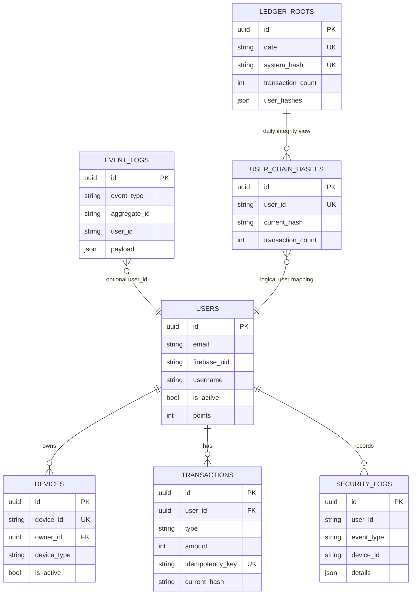

# DB Schema Overview

## 기준
- SQLAlchemy 모델 기준
- 모델 레지스트리: `app/db/model_registry.py`
- baseline migration: `alembic/versions/20260211_0001_baseline.py`

## ERD (High-level)

## 공통
대부분 테이블은 `app/models/base.py`의 공통 컬럼을 포함합니다.
- `id` (UUID PK)
- `created_at`
- `updated_at`
- `is_deleted`

## 인증/보안 도메인
### `users`
- 목적: 사용자 계정/프로필/포인트
- 주요 컬럼:
  - `email`
  - `password_hash`
  - `firebase_uid` (unique)
  - `name`, `picture`, `username` (username unique)
  - `is_active`
  - `points`
  - `last_login`

### `devices`
- 목적: IoT 디바이스 인증 주체
- 주요 컬럼:
  - `device_id` (unique)
  - `device_secret_hash`
  - `owner_id` (FK -> `users.id`)
  - `name`, `device_type`
  - `is_active`
  - `last_seen`, `secret_rotated_at`

### `security_logs`
- 목적: 보안 이벤트 감사 로그
- 주요 컬럼:
  - `user_id`
  - `event_type`
  - `device_id`
  - `details` (JSON)
  - `ip_address`, `user_agent`
- 주요 인덱스:
  - `(user_id, event_type, created_at)`
  - `(device_id, event_type, created_at)`

## 이벤트/포인트/원장 도메인
### `event_logs`
- 목적: 도메인 이벤트 불변 기록
- 주요 컬럼:
  - `event_type`, `aggregate_id`, `user_id`
  - `payload` (JSON)
  - `processed_at`, `error_message`
- 주요 인덱스:
  - `(event_type, created_at)`
  - `(aggregate_id, created_at)`
  - `(user_id, created_at)`

### `transactions`
- 목적: 포인트 거래 + 해시체인 데이터
- 주요 컬럼:
  - `user_id` (FK -> `users.id`)
  - `type` (charge/consume/refund)
  - `amount`, `balance_after`
  - `idempotency_key` (unique)
  - `prev_hash`, `current_hash`, `tx_data`

### `ledger_roots`
- 목적: 일자별 시스템 루트 해시
- 주요 컬럼:
  - `date` (unique)
  - `system_hash` (unique)
  - `transaction_count`
  - `user_hashes` (JSON)
  - `is_published`

### `user_chain_hashes`
- 목적: 사용자별 체인 상태 추적
- 주요 컬럼:
  - `user_id` (unique)
  - `current_hash`
  - `transaction_count`
  - `last_transaction_at`, `chain_started_at`

## 변경 시 주의
- 테이블/컬럼 변경은 `docs/DB_MIGRATION_WORKFLOW.md` 절차를 따릅니다.
- 파괴적 변경은 즉시 적용하지 말고 expand-contract로 분리합니다.
